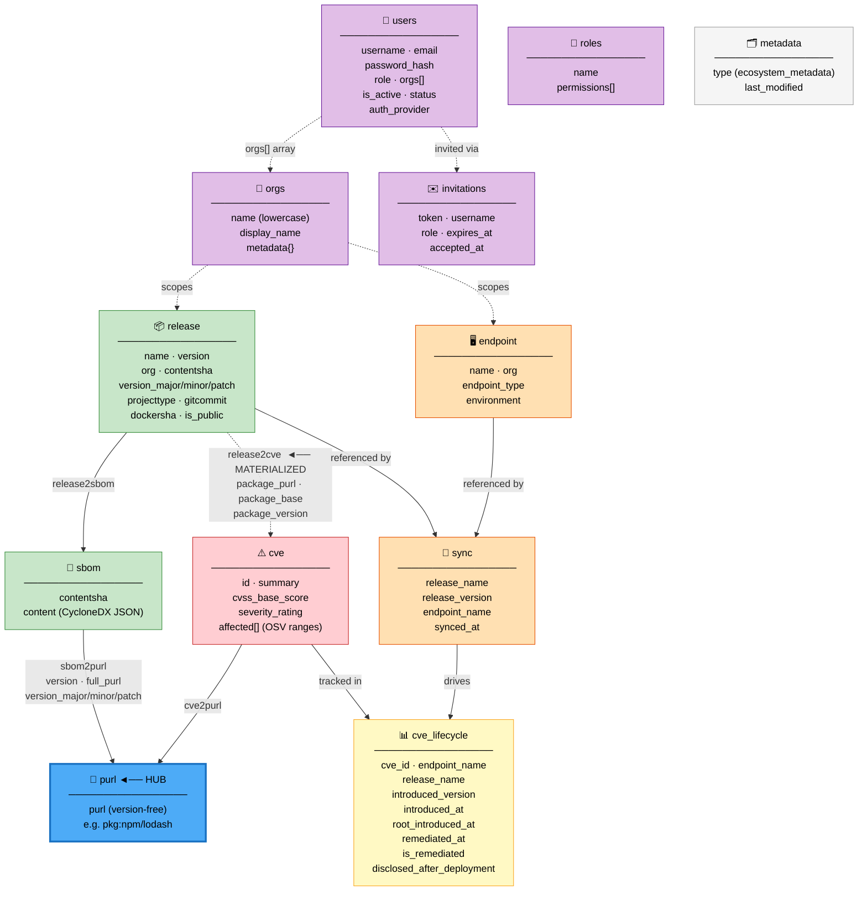

# Implementation Guide

**Audience:** Backend engineers integrating the Ortelius API, writing GraphQL queries, or contributing to the codebase.

---

## Table of Contents

1. [REST API Reference](#rest-api-reference)
2. [GraphQL Reference](#graphql-reference)
3. [GraphQL Query Examples](#graphql-query-examples)
4. [Kafka Event Schema](#kafka-event-schema)
5. [Database Schema](#database-schema)
6. [PURL Standardization](#purl-standardization)
7. [Version Matching](#version-matching)
8. [CVE Lifecycle Implementation](#cve-lifecycle-implementation)

---

## REST API Reference

Base URL (hosted): `https://app.deployhub.com/api/v1`
Base URL (local): `http://localhost:3000/api/v1`

Authentication: JWT cookie (`auth_token`) set via `POST /auth/login`. Pass as `-b "auth_token=<token>"` in curl or via the `Cookie` header.

### Authentication Endpoints

#### `POST /auth/login`

```json
// Request
{ "username": "alice", "password": "secure-pass" }

// Response 200
// Set-Cookie: auth_token=<jwt>; HttpOnly; SameSite=Lax
{ "message": "Login successful", "username": "alice", "email": "...", "role": "owner", "orgs": ["acme"] }

// Response 401
{ "error": "Invalid credentials" }
```

#### `POST /auth/logout`

Clears the auth cookie. No request body required.

#### `GET /auth/me`

Returns current user info. Works with or without authentication (`OptionalAuth`).

```json
// Response 200 (authenticated)
{ "username": "alice", "email": "...", "role": "owner", "orgs": ["acme"], "github_connected": false }
```

#### `POST /auth/change-password` (RequireAuth)

```json
{ "old_password": "...", "new_password": "..." }
```

#### `POST /auth/refresh`

Refreshes the JWT cookie using the existing cookie. No body required.

### Signup & Invitations

#### `POST /signup` (Public)

Creates a new user and org via the GitOps flow. Requires `RBAC_REPO` or `RBAC_CONFIG_PATH` to be configured.

```json
// Request
{
  "username": "alice",
  "email": "alice@acme.com",
  "first_name": "Alice",
  "last_name": "Smith",
  "organization": "acme-corp"
}

// Response 201
{ "success": true, "message": "Signup request processed. Configuration updated and invitation sent." }

// Response 409 — username/email taken
{ "error": "Username or Email is already in use" }

// Response 409 — org exists
{ "error": "Organization 'acme-corp' already exists. Please contact the organization administrator at alice@acme.com to join." }
```

#### `GET /invitation/:token`

```json
// Response 200
{ "username": "alice", "email": "alice@acme.com", "role": "editor" }

// Response 410 — expired or already accepted
{ "error": "Invitation no longer valid" }
```

#### `POST /invitation/:token/accept`

```json
// Request
{ "password": "newpassword", "password_confirm": "newpassword" }

// Response 200 — sets auth cookie (auto-login)
{ "message": "Account activated. You are now logged in.", "username": "alice" }
```

#### `POST /invitation/:token/resend`

Resends the invitation email and extends expiry by 48 hours. No request body.

### Releases

#### `POST /releases` (OptionalAuth)

Uploads a release with its SBOM. Triggers PURL extraction and CVE linking.

```json
// Request
{
  "name": "acme/payment-service",
  "version": "2.1.0",
  "gitcommit": "abc123def456",
  "org": "acme",
  "projecttype": "docker",
  "dockersha": "sha256:abc...",
  "sbom": {
    "content": {
      "bomFormat": "CycloneDX",
      "specVersion": "1.5",
      "components": [
        {
          "type": "library",
          "name": "lodash",
          "version": "4.17.20",
          "purl": "pkg:npm/lodash@4.17.20"
        }
      ]
    }
  }
}

// Response 201
{ "success": true, "message": "Release and SBOM processed successfully" }

// Response 400 — missing fields
{ "success": false, "message": "Release name, version, and SBOM content are required" }
```

**Content SHA / Deduplication:** The release is deduplicated by `(name, version, contentsha)`. `contentsha` is populated from `gitcommit` for non-docker projects, or `dockersha` for `projecttype: docker`. Re-uploading the same release with an identical contentsha is a no-op. A different contentsha (e.g., a new git commit on the same version tag) creates a new record.

**Org derivation:** If `org` is not set in the request body, it is parsed from the `name` field. `acme/payment-service` → `org=acme`, `shortname=payment-service`. A name with no slash defaults to `org=library`. Always pass `org` explicitly or use the `org/name` convention.

### Sync

#### `POST /sync` (OptionalAuth)

Records the current deployment state of an endpoint.

```json
// Request
{
  "endpoint_name": "prod-us-east-1",
  "synced_at": "2024-12-01T10:00:00Z",  // optional — defaults to now
  "releases": [
    {
      "release": { "name": "acme/payment-service", "version": "2.1.0" },
      "sbom": null  // optional — include to upload SBOM inline with sync
    }
  ],
  "endpoint": {
    "name": "prod-us-east-1",
    "endpoint_type": "eks",
    "environment": "production",
    "org": "acme"
  }
}

// Response 201
{
  "success": true,
  "message": "Created sync snapshot with 1 releases for endpoint prod-us-east-1",
  "synced_at": "2024-12-01T10:00:00Z",
  "total_synced": 1,
  "created": 0,
  "updated": 1,
  "unchanged": 0,
  "errors": 0,
  "results": [
    { "name": "acme/payment-service", "version": "2.1.0", "status": "updated", "sync_key": "sync_...", "message": "Release processed successfully" }
  ]
}
```

**Result status values:** `created`, `created_with_sbom`, `updated`, `updated_with_sbom`, `unchanged`, `error`

**Partial sync:** Only releases in the `releases` array are swept and resurrected. Releases previously synced to this endpoint but absent from this request are left unchanged.

### User Management (RequireAuth + RequireRole("admin"))

```text
GET    /users/                          List all users
POST   /users/                          Create user directly (bypasses GitOps)
GET    /users/:username                 Get user by username
PUT    /users/:username                 Update email, role, orgs, is_active
DELETE /users/:username                 Delete user
```

### RBAC Management (RequireAuth + RequireRole("admin"))

```text
POST   /rbac/apply/content              Apply YAML config from request body (Content-Type: application/x-yaml)
POST   /rbac/apply/upload               Apply YAML config from multipart file upload
POST   /rbac/apply                      Apply from filesystem path (JSON body: {"file_path": "/etc/ortelius/rbac.yaml"})
POST   /rbac/validate                   Validate YAML without applying
GET    /rbac/config                     Export current config as YAML
GET    /rbac/invitations                List pending (unaccepted) invitations
POST   /rbac/webhook                    Pull latest rbac.yaml from RBAC_REPO and apply
```

---

## GraphQL Reference

**Endpoint:** `POST /api/v1/graphql`

All queries support an `org` argument for filtering. Pass an empty string or omit to return data across all orgs (admin only — non-admin users are automatically scoped by their org memberships via the `orgAggregatedReleases` resolver).

### Full Schema

```graphql
type Query {
  # Releases
  release(name: String!, version: String!): Release
  affectedReleases(severity: Severity!, limit: Int, org: String): [AffectedRelease!]!
  orgAggregatedReleases(severity: Severity!): [OrgAggregatedRelease!]!

  # Vulnerabilities
  vulnerabilities(limit: Int, org: String): [Mitigation!]!

  # Endpoints
  syncedEndpoints(limit: Int, org: String): [SyncedEndpointWithVulns!]!
  endpointDetails(name: String!): EndpointDetails

  # Dashboard
  dashboardOverview: DashboardOverview
  dashboardSeverity: SeverityDistribution
  dashboardTopRisks(limit: Int, type: String, org: String): [RiskyAsset!]!
  dashboardVulnerabilityTrend(days: Int, org: String): [VulnerabilityTrend!]!
  dashboardGlobalStatus(limit: Int, org: String): DashboardGlobalStatus
  dashboardMTTR(days: Int, org: String): MTTRAnalysis!
}

enum Severity { CRITICAL HIGH MEDIUM LOW NONE }

type Release {
  name: String
  version: String
  project_type: String
  git_commit: String
  git_url: String
  build_date: String
  docker_sha: String
  openssf_scorecard_score: Float
  vulnerabilities: [Vulnerability!]!
  synced_endpoints: [AffectedEndpoint!]!
  synced_endpoint_count: Int
  dependency_count: Int
  sbom: SBOM
  scorecard_result: ScorecardResult
}

type Vulnerability {
  cve_id: String
  summary: String
  details: String
  severity_score: Float
  severity_rating: String
  cvss_v3_score: String
  published: String
  modified: String
  aliases: [String!]
  package: String
  affected_version: String
  full_purl: String
  fixed_in: [String!]
}

type AffectedRelease {
  cve_id: String
  summary: String
  severity_score: Float
  severity_rating: String
  package: String
  affected_version: String
  fixed_in: [String!]
  release_name: String
  release_version: String
  version_count: Int
  openssf_scorecard_score: Float
  dependency_count: Int
  synced_endpoint_count: Int
  vulnerability_count: Int
  vulnerability_count_delta: Int
}

type OrgAggregatedRelease {
  org_name: String
  total_releases: Int
  total_versions: Int
  total_vulnerabilities: Int
  critical_count: Int
  high_count: Int
  medium_count: Int
  low_count: Int
  max_severity_score: Float
  avg_scorecard_score: Float
  total_dependencies: Int
  synced_endpoint_count: Int
  vulnerability_count_delta: Int
}

type SyncedEndpointWithVulns {
  endpoint_name: String
  endpoint_url: String
  endpoint_type: String
  environment: String
  status: String
  last_sync: String
  release_count: Int
  total_vulnerabilities: VulnerabilityCount
  releases: [ReleaseInfo!]
}

type EndpointDetails {
  endpoint_name: String
  endpoint_type: String
  environment: String
  status: String
  last_sync: String
  total_vulnerabilities: VulnerabilityCount
  vulnerability_count_delta: Int
  releases: [EndpointRelease!]
}

type EndpointRelease {
  release_name: String
  release_version: String
  openssf_scorecard_score: Float
  dependency_count: Int
  last_sync: String
  vulnerability_count: Int
  vulnerability_count_delta: Int
  vulnerabilities: [Vulnerability!]
}

type VulnerabilityCount {
  critical: Int
  high: Int
  medium: Int
  low: Int
}

type MTTRAnalysis {
  executive_summary: ExecutiveSummary!
  by_severity: [DetailedSeverityMetrics!]!
  endpoint_impact: EndpointImpactMetrics!
}

type ExecutiveSummary {
  total_new_cves: Int
  total_fixed_cves: Int
  post_deployment_cves: Int
  mttr_all: Float
  mttr_post_deployment: Float
  mean_open_age_all: Float
  mean_open_age_post_deploy: Float
  open_cves_beyond_sla_pct: Float
  oldest_open_critical_days: Float
  backlog_delta: Int
  fixed_within_sla_pct: Float
}

type DetailedSeverityMetrics {
  severity: String
  mttr: Float
  mttr_post_deployment: Float
  fixed_within_sla_pct: Float
  mean_open_age: Float
  mean_open_age_post_deploy: Float
  oldest_open_days: Float
  open_beyond_sla_pct: Float
  open_beyond_sla_count: Int
  new_detected: Int
  remediated: Int
  open_count: Int
  backlog_count: Int
}

type EndpointImpactMetrics {
  affected_endpoints_count: Int
  post_deployment_cves_by_type: [EndpointImpactCount!]
}

type DashboardOverview {
  total_releases: Int
  total_endpoints: Int
  total_cves: Int
}

type SeverityDistribution {
  critical: Int
  high: Int
  medium: Int
  low: Int
}

type RiskyAsset {
  name: String
  version: String
  critical_count: Int
  high_count: Int
  total_vulns: Int
}

type VulnerabilityTrend {
  date: String
  critical: Int
  high: Int
  medium: Int
  low: Int
}

type DashboardGlobalStatus {
  critical: SeverityMetric
  high: SeverityMetric
  medium: SeverityMetric
  low: SeverityMetric
  total_count: Int
  total_delta: Int
  high_risk_backlog: Int
  high_risk_delta: Int
}

type SeverityMetric {
  count: Int
  delta: Int
}

type Mitigation {
  cve_id: String
  summary: String
  severity_score: Float
  severity_rating: String
  package: String
  affected_version: String
  full_purl: String
  fixed_in: [String!]
  affected_releases: Int
  affected_endpoints: Int
}
```

---

## GraphQL Query Examples

### Get vulnerabilities for a specific release

```graphql
query {
  release(name: "acme/payment-service", version: "2.1.0") {
    name
    version
    openssf_scorecard_score
    dependency_count
    vulnerabilities {
      cve_id
      severity_rating
      severity_score
      package
      affected_version
      fixed_in
      summary
    }
    synced_endpoints {
      endpoint_name
      environment
      last_sync
    }
  }
}
```

### List all critical+ vulnerabilities across an org

```graphql
query {
  affectedReleases(severity: CRITICAL, org: "acme") {
    release_name
    release_version
    cve_id
    severity_rating
    severity_score
    package
    affected_version
    fixed_in
    vulnerability_count
    vulnerability_count_delta
    synced_endpoint_count
  }
}
```

### Executive dashboard summary (180-day MTTR)

```graphql
query {
  dashboardMTTR(days: 180, org: "acme") {
    executive_summary {
      total_new_cves
      total_fixed_cves
      post_deployment_cves
      mttr_all
      mttr_post_deployment
      mean_open_age_all
      open_cves_beyond_sla_pct
      backlog_delta
      fixed_within_sla_pct
      oldest_open_critical_days
    }
    by_severity {
      severity
      mttr
      open_count
      open_beyond_sla_pct
      open_beyond_sla_count
      fixed_within_sla_pct
      mean_open_age
    }
    endpoint_impact {
      affected_endpoints_count
      post_deployment_cves_by_type {
        type
        count
      }
    }
  }
}
```

### Vulnerability trend over 90 days

```graphql
query {
  dashboardVulnerabilityTrend(days: 90, org: "acme") {
    date
    critical
    high
    medium
    low
  }
}
```

### Endpoint list with vulnerability counts

```graphql
query {
  syncedEndpoints(org: "acme") {
    endpoint_name
    endpoint_type
    environment
    last_sync
    release_count
    total_vulnerabilities {
      critical
      high
      medium
      low
    }
  }
}
```

### Endpoint detail — all releases and their CVEs

```graphql
query {
  endpointDetails(name: "prod-us-east-1") {
    endpoint_name
    endpoint_type
    environment
    last_sync
    vulnerability_count_delta
    total_vulnerabilities { critical high medium low }
    releases {
      release_name
      release_version
      vulnerability_count
      vulnerability_count_delta
      vulnerabilities {
        cve_id
        severity_rating
        package
        affected_version
        fixed_in
      }
    }
  }
}
```

### Top 10 riskiest releases

```graphql
query {
  dashboardTopRisks(limit: 10, type: "releases", org: "acme") {
    name
    version
    critical_count
    high_count
    total_vulns
  }
}
```

### Org-aggregated view (for multi-org admins)

```graphql
query {
  orgAggregatedReleases(severity: NONE) {
    org_name
    total_releases
    total_vulnerabilities
    critical_count
    high_count
    medium_count
    low_count
    avg_scorecard_score
    synced_endpoint_count
    vulnerability_count_delta
  }
}
```

### Global status with 30-day deltas

```graphql
query {
  dashboardGlobalStatus(org: "acme") {
    critical { count delta }
    high { count delta }
    medium { count delta }
    low { count delta }
    total_count
    total_delta
    high_risk_backlog
    high_risk_delta
  }
}
```

---

## Kafka Event Schema

Topic: `release-events`
Event type: `release.sbom.created`

```json
{
  "event_type": "release.sbom.created",
  "event_id": "550e8400-e29b-41d4-a716-446655440000",
  "event_time": "2023-10-27T10:00:00Z",
  "schema_version": "v1",
  "release": {
    "name": "acme/payment-service",
    "version": "v2.1.0",
    "projecttype": "docker",
    "gitcommit": "af32c1b",
    "dockersha": "sha256:45b34006...77a",
    "is_public": true
  },
  "sbom_ref": {
    "cid": "QmXoypizjW3WknFiJnKLwHCnL72vedxjQkDDP1mXWo6uco",
    "storage_type": "ipfs",
    "content_sha": "e3b0c44298fc1c149afbf4c8996fb924...",
    "uploaded_at": "2023-10-27T09:50:00Z"
  }
}
```

**Required fields:** `event_type`, `event_id`, `event_time`, `release.name`, `release.version`, `sbom_ref.cid`, `sbom_ref.storage_type`

`storage_type` values: `ipfs`, `s3`

The processor fetches the SBOM content by CID via the `SBOMFetcher` interface, then runs the same `ProcessReleaseIngestion` pipeline as `POST /releases`.

---

## Database Schema

### Collection & Edge Map

The diagram below shows all document collections (rectangles), edge collections (arrows), and the direction of traversal. Hub nodes (`purl`) sit at the centre of the graph — they are the join point between vulnerability data and SBOM data. Materialized edges (`release2cve`) shortcut the full hub traversal for runtime queries.



**Key traversal paths:**

| Goal                            | Path                                                                      |
|---------------------------------|---------------------------------------------------------------------------|
| CVEs for a release (fast)       | `release` →[release2cve]→ `cve`                                           |
| CVEs for a release (full graph) | `release` →[release2sbom]→ `sbom` →[sbom2purl]→ `purl` ←[cve2purl]← `cve` |
| Releases affected by a CVE      | `cve` ←[release2cve]← `release`                                           |
| Packages in an SBOM             | `sbom` →[sbom2purl]→ `purl` (version on edge)                             |
| Active CVEs on an endpoint      | `cve_lifecycle` filtered by `endpoint_name + is_remediated=false`         |
| Latest deployment state         | `sync` grouped by `(endpoint_name, release_name)`, max `synced_at`        |

**Solid arrows** = ArangoDB edge collections (graph traversal).
**Dashed arrows** = logical relationships stored as fields or arrays (filtered in AQL, not traversed as graph edges).

### Document Collections

#### `release`

```json
{
  "_key": "acme-payment-service_2.1.0",
  "name": "acme/payment-service",
  "version": "2.1.0",
  "version_major": 2,
  "version_minor": 1,
  "version_patch": 0,
  "version_prerelease": "",
  "org": "acme",
  "shortname": "payment-service",
  "is_public": false,
  "contentsha": "abc123def456",
  "projecttype": "docker",
  "gitcommit": "abc123def456",
  "dockersha": "sha256:...",
  "openssf_scorecard_score": 8.5,
  "objtype": "ProjectRelease"
}
```

#### `sbom`

```json
{
  "_key": "...",
  "contentsha": "sha256:...",
  "objtype": "SBOM",
  "content": { /* CycloneDX JSON */ }
}
```

#### `purl` (Hub Node — version-free)

```json
{
  "_key": "pkg:npm/lodash",
  "purl": "pkg:npm/lodash",
  "objtype": "PURL"
}
```

#### `cve`

```json
{
  "_key": "CVE-2024-1234",
  "id": "CVE-2024-1234",
  "summary": "Buffer overflow in lodash",
  "published": "2024-11-15T00:00:00Z",
  "database_specific": {
    "cvss_base_score": 9.8,
    "severity_rating": "CRITICAL"
  },
  "affected": [
    {
      "package": { "ecosystem": "npm", "name": "lodash" },
      "ranges": [
        { "type": "SEMVER", "events": [{"introduced": "0"}, {"fixed": "4.17.21"}] }
      ]
    }
  ]
}
```

#### `endpoint`

```json
{
  "_key": "prod-us-east-1",
  "name": "prod-us-east-1",
  "org": "acme",
  "endpoint_type": "eks",
  "environment": "production",
  "is_public": true,
  "objtype": "Endpoint"
}
```

#### `sync`

```json
{
  "_key": "sync_prod-us-east-1_1733011200",
  "release_name": "acme/payment-service",
  "release_version": "2.1.0",
  "release_version_major": 2,
  "release_version_minor": 1,
  "release_version_patch": 0,
  "endpoint_name": "prod-us-east-1",
  "synced_at": "2024-12-01T00:00:00Z",
  "objtype": "Sync"
}
```

#### `cve_lifecycle`

```json
{
  "_key": "...",
  "cve_id": "CVE-2024-1234",
  "endpoint_name": "prod-us-east-1",
  "release_name": "acme/payment-service",
  "introduced_version": "2.1.0",
  "package": "pkg:npm/lodash",
  "severity_rating": "CRITICAL",
  "severity_score": 9.8,
  "introduced_at": "2024-12-01T00:00:00Z",
  "root_introduced_at": "2024-11-01T00:00:00Z",
  "remediated_at": null,
  "is_remediated": false,
  "disclosed_after_deployment": false,
  "objtype": "CVELifecycleEvent"
}
```

#### `users`

```json
{
  "_key": "alice",
  "username": "alice",
  "email": "alice@acme.com",
  "password_hash": "$2a$10$...",
  "role": "owner",
  "orgs": ["acme"],
  "is_active": true,
  "status": "active",
  "auth_provider": "local",
  "github_installation_id": "",
  "github_token": ""
}
```

#### `invitations`

```json
{
  "token": "tok_abc123",
  "username": "bob",
  "email": "bob@acme.com",
  "role": "editor",
  "expires_at": "2024-12-03T10:00:00Z",
  "accepted_at": null,
  "resend_count": 0,
  "created_at": "2024-12-01T10:00:00Z"
}
```

#### `orgs`

```json
{
  "_key": "acme",
  "name": "acme",
  "display_name": "ACME Corporation",
  "description": "Main enterprise customer",
  "metadata": { "owner": "alice", "tier": "enterprise" }
}
```

### Edge Collections

#### `sbom2purl`

```json
{
  "_from": "sbom/<key>",
  "_to": "purl/pkg:npm/lodash",
  "version": "4.17.20",
  "full_purl": "pkg:npm/lodash@4.17.20",
  "ecosystem": "npm",
  "version_major": 4,
  "version_minor": 17,
  "version_patch": 20
}
```

#### `cve2purl`

```json
{
  "_from": "cve/CVE-2024-1234",
  "_to": "purl/pkg:npm/lodash"
}
```

#### `release2sbom`

```json
{
  "_from": "release/<key>",
  "_to": "sbom/<key>"
}
```

#### `release2cve` (Materialized)

```json
{
  "_from": "release/<key>",
  "_to": "cve/CVE-2024-1234",
  "type": "static_analysis",
  "package_purl": "pkg:npm/lodash@4.17.20",
  "package_base": "pkg:npm/lodash",
  "package_version": "4.17.20",
  "created_at": "2024-12-01T00:00:00Z"
}
```

### Index Reference

| Collection    | Index Name                         | Fields                                                                              | Unique  |
|---------------|------------------------------------|-------------------------------------------------------------------------------------|---------|
| cve           | package_name                       | affected[*].package.name                                                            | No      |
| cve           | package_purl                       | affected[*].package.purl                                                            | No      |
| cve           | cve_id                             | id                                                                                  | No      |
| sbom          | sbom_contentsha                    | contentsha                                                                          | No      |
| release       | release_contentsha                 | contentsha                                                                          | No      |
| release       | release_org_name_version_order     | org, name, version_major, version_minor, version_patch, version_prerelease, version | No      |
| purl          | purl_idx                           | purl                                                                                | **Yes** |
| users         | users_username                     | username                                                                            | **Yes** |
| users         | users_email                        | email                                                                               | **Yes** |
| invitations   | idx_token                          | token                                                                               | **Yes** |
| invitations   | idx_invitation_username            | username                                                                            | No      |
| invitations   | idx_expires_at                     | expires_at                                                                          | No      |
| cve_lifecycle | lifecycle_cve_id                   | cve_id                                                                              | No      |
| cve_lifecycle | lifecycle_remediated               | is_remediated                                                                       | No      |
| cve_lifecycle | lifecycle_endpoint_release_version | endpoint_name, release_name, introduced_version                                     | No      |
| sync          | sync_endpoint_release              | endpoint_name, release_name                                                         | No      |
| sync          | sync_release_name_version          | release_name, release_version                                                       | No      |

---

## PURL Standardization

All PURL hub keys are generated through a single pipeline in `util.GetStandardBasePURL()`:

1. Parse the full PURL (with version, qualifiers)
2. Normalize the type via `EcosystemToPurlType` mapping
3. Return lowercase base PURL without version, qualifiers, or subpath

**Ecosystem type mapping:**

| OSV Ecosystem | PURL Type |
|---------------|-----------|
| npm           | npm       |
| PyPI          | pypi      |
| Maven         | maven     |
| Go            | golang    |
| NuGet         | nuget     |
| RubyGems      | gem       |
| crates.io     | cargo     |
| Packagist     | composer  |
| Alpine        | apk       |
| Wolfi         | apk       |
| Chainguard    | apk       |
| Debian        | deb       |
| Ubuntu        | deb       |

Wolfi and Chainguard map to `apk` so that CVEs from those OSV ecosystems match `pkg:apk/...` PURLs in SBOMs — without this mapping, Wolfi/Chainguard CVEs would never link.

Always call `util.GetStandardBasePURL()` or `util.GetBasePURLFromComponents()` for hub key generation. Never construct PURL hub keys manually.

---

## Version Matching

`util.IsVersionAffected(version string, affected models.Affected) bool` uses ecosystem-specific parsers:

| Ecosystem  | Parser                                  |
|------------|-----------------------------------------|
| npm        | aquasecurity/go-npm-version             |
| PyPI       | aquasecurity/go-pep440-version          |
| All others | Masterminds/semver with string fallback |

**Critical rules:**

- OSV `"0"` in `introduced` is treated as `0.0.0` (start of time), not the literal string `"0"`
- Both a lower bound (`introduced`) AND an upper bound (`fixed` or `last_affected`) must be present. Ranges with only one boundary return `false` to avoid false positives
- Go stdlib versions with `go` prefix (e.g., `go1.22.2`) have the prefix stripped before semver parsing
- `util.CleanVersion()` strips branch prefixes from version strings (e.g., `main-v12.0.1` → `12.0.1`)

---

## CVE Lifecycle Implementation

### Materialized Edge Creation (`linkReleaseToExistingCVEs`)

Called at the end of every `ProcessReleaseIngestion`:

1. Delete existing `release2cve` edges for this release
2. Traverse: Release → SBOM → PURL hubs → CVEs (via `cve2purl`)
3. For each candidate, filter by matching `affected.package.purl` against hub PURL
4. Validate with `util.IsVersionAffected(sbomEdgeVersion, matchedAffected)`
5. Deduplicate by `(cve_id, package_base_purl)`
6. Batch-insert `release2cve` edges

### Sweep and Resurrect (`SupersedeAllActiveCVEs` + `CreateOrUpdateLifecycleRecord`)

Called for each release during `POST /sync`:

**Sweep:**

```aql
FOR doc IN cve_lifecycle
  FILTER doc.endpoint_name == @endpoint_name
  FILTER doc.release_name == @release_name
  FILTER doc.is_remediated == false
  UPDATE doc WITH {
    is_remediated: true,
    remediated_at: @superseded_at,
    remediation_status: "Superseded"
  } IN cve_lifecycle
```

**Resurrect:**
For each CVE in the new version, `CreateOrUpdateLifecycleRecord` checks if the exact `(cve_id, package, release_name, endpoint_name, introduced_version)` record already exists:

- If it does, clear `is_remediated` and `remediated_at` (resurrection)
- If it doesn't, create a new record and inherit `root_introduced_at` from the previous version's record if the same CVE was present there

### `root_introduced_at` Lookup

```aql
LET prev_version = (
  FOR s IN sync
    FILTER s.release_name == @release_name AND s.endpoint_name == @endpoint_name
    AND DATE_TIMESTAMP(s.synced_at) < DATE_TIMESTAMP(@now)
    SORT s.synced_at DESC LIMIT 1 RETURN s.release_version
)[0]

FOR r IN cve_lifecycle
  FILTER r.cve_id == @cve_id AND r.package == @package
  AND r.release_name == @release_name AND r.endpoint_name == @endpoint_name
  AND r.introduced_version == prev_version
  RETURN r.root_introduced_at != null ? r.root_introduced_at : r.introduced_at
```

If no previous version record is found, `root_introduced_at` defaults to the current sync time (`introduced_at`).
